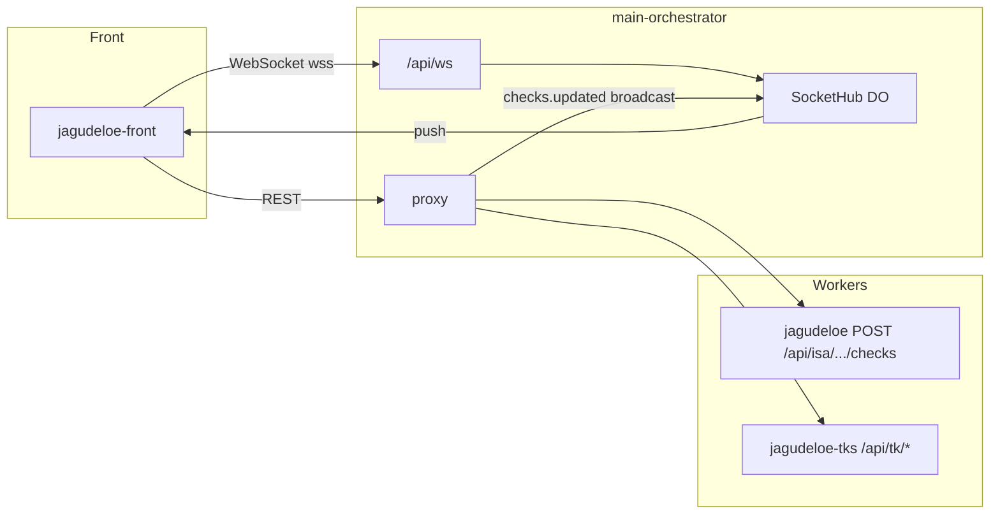

<p align="center">
  
</p>

<h1 align="center">jagudeloe-front</h1>

<p align="center"><strong>JAGUDELOE</strong> — bitácora, tickets tk_* y checks de revisión para PatyIA y ClientesIS.</p>

## Arquitectura (checks en tiempo real)



[](https://jeff-aporta.github.io/jagudeloe-front/)
[](https://react.dev/)
[](https://marked.js.org/)
[](https://github.com/Jeff-Aporta/jagudeloe-back)
[](https://neon.tech/)

## Demo

**https://jeff-aporta.github.io/jagudeloe-front/**

## Vista previa


> La UI carga en GH Pages; los datos requieren el Worker [`jagudeloe-back`](https://github.com/Jeff-Aporta/jagudeloe-back) desplegado.

## Qué hace

- **Spaces**: PatyIA · ClientesIS (sidebar permanente).
- **Bitácora**: layout + segmentos MD/SQL renderizados (Marked + estilos dedicados).
- **Tickets**: consulta pública del entity store con filtro por estado.
- **Checks**: revisados de bitácora; lectura pública, escritura con JWT.
- **Estado en URL** (`?s=`) para space/subspace.
- **Tema** dodgerblue dark/light y toggle **orquestador local / producción**.

## Metadatos

Icono: `mdi:notebook-outline` · tema `#37474f` · [`JeffAppMeta`](https://github.com/Jeff-Aporta/front-shared/blob/main/cdn/isa/js/core/app-meta.js).

## Desarrollo local

```bash
npx serve .
# main-orchestrator en :8780
```

## Repos relacionados

| Repo | Rol |
|------|-----|
| [jagudeloe-back](https://github.com/Jeff-Aporta/jagudeloe-back) | API JAGUDELOE (Worker) |
| [jagudeloe-front](https://github.com/Jeff-Aporta/jagudeloe-front) | Este panel (GH Pages) |

MIT · [Jeff-Aporta](https://github.com/Jeff-Aporta)
