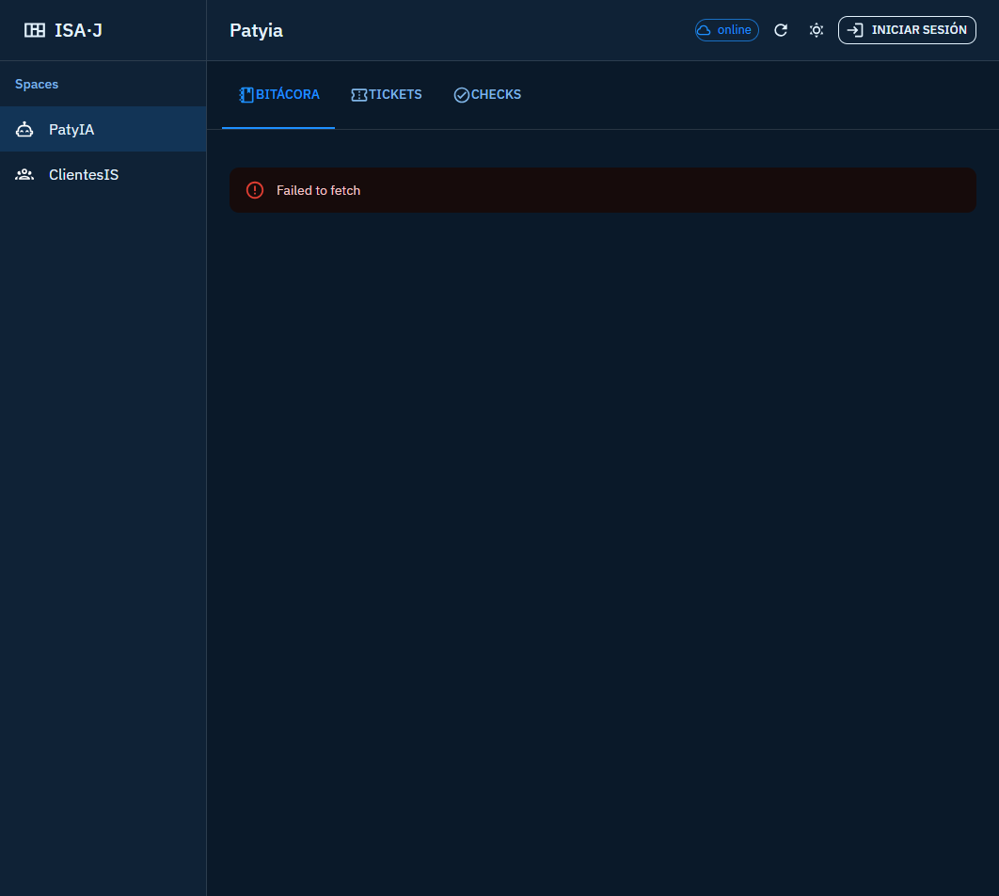

<p align="center">
  
</p>

<h1 align="center">jagudeloe-front</h1>

<p align="center"><strong>JAGUDELOE</strong> — bitácora, tickets y revisión para PatyIA y ClientesIS.</p>

[](https://jeff-aporta.github.io/jagudeloe-front/)
[](https://react.dev/)
[](https://marked.js.org/)

## Demo

**https://jeff-aporta.github.io/jagudeloe-front/**

## Vista previa



## Qué hace

- **PatyIA y ClientesIS**: dos espacios de trabajo en la misma pantalla
- **Bitácora**: notas del día con texto y consultas SQL
- **Tickets**: listado y detalle por estado
- **Revisión**: marcar contenido como revisado (requiere login)
- **Tema** claro/oscuro y modo local o producción

Icono: `mdi:notebook-outline` · tema `#37474f`

## Vista local

```bash
cd frontend
npx serve .
```

MIT · [Jeff-Aporta](https://github.com/Jeff-Aporta)
